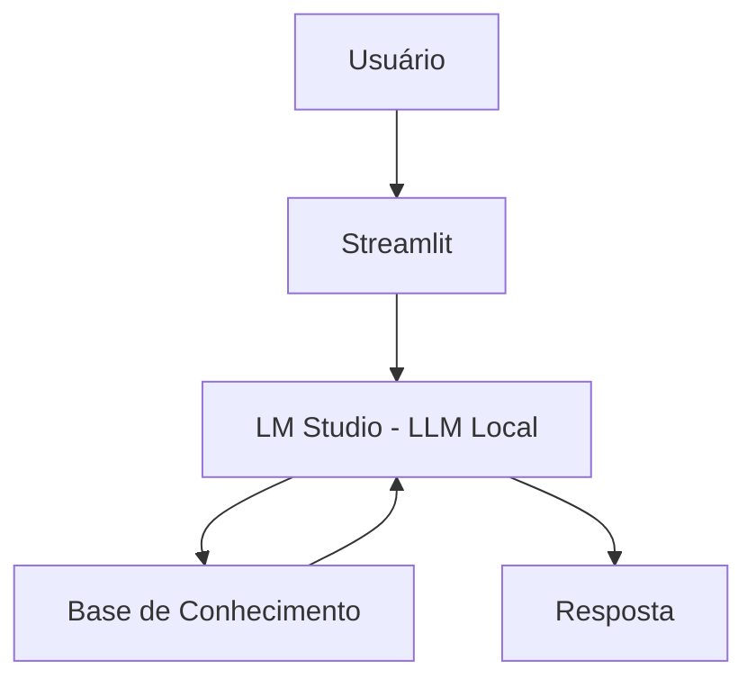

# 👵💬 Manu, sua Agente Financeira

> Agente de IA Generativa que ajuda idosos a utilizarem o aplicativo do banco de forma simples e segura.

## 💡 O Que é a Manu?

A Manu é uma assistente financeira que ajuda os idosos a utilizar o aplicativo, ela explica o passo a passo das operações e é intuitiva. 

**O que a Manu faz:**
- ✅ Explica conceitos financeiros de forma simples
- ✅ Usa dados do cliente como exemplos práticos
- ✅ Responde dúvidas sobre a utilização do aplicativo
- ✅ Analisa padrões de gastos

**O que a Manu NÃO faz:**
- ❌ Não recomenda investimentos específicos
- ❌ NÃO inventa informações
- ❌ Não substitui um profissional certificado

## 🏗️ Arquitetura



**Stack:**
- Interface: Streamlit
- LM STUDIO: Local (modelo local `meta-llama-3.1-8b-instruct`)
- Dados: JSON/CSV mockados

## 📁 Estrutura do Projeto

```
├── data/                              
│   ├── historico_de_transacoes.csv     # Histórico financeiro do cliente
│   └── perfil_do_cliente.json        # Perfil do cliente
│
├── services/                     
│   ├── __init__.py 
│   └── conexao_lm_studio.py            # Conexão com o LM Studio 
│
├── src/
│   ├── __init__.py
│   ├── script_prompt.py                # Leitura dos arquivos e contexto prompt
│   └── app.py                          # Aplicação Streamlit - Interface
└── docs/                         
   ├── 01-documentacao-agente.md        # Descrição sobre o Agente e suas características 
   └── 02-testes-agente.md              # Prompts para os testes            
```

## 🤖 Como Executar

### 1. Instalar LM Studio

```bash
# Baixar em: https://lmstudio.ai/download
# Faça donwload do modelo: meta-llama-3.1-8b-instruct
# Inicie o modelo no aplicativo
```

### 2. Instalar Dependências

```bash
pip install streamlit pandas openai
```

### 3. Rodar a Manu 

```bash
streamlit run src/app.py
```

## 🎬 Diferenciais

- **Personalização:** Usa os dados do próprio cliente nos exemplos
- **100% Local:** Roda com LM Studio, sem enviar dados para APIs externas
- **Público-alvo:** Idosos
- **Seguro:** Estratégias de anti-alucinação documentadas

## 📝 Documentação Completa

Toda a documentação técnica, estratégias de prompt e casos de teste estão disponíveis na pasta [`docs/`](./docs/).
